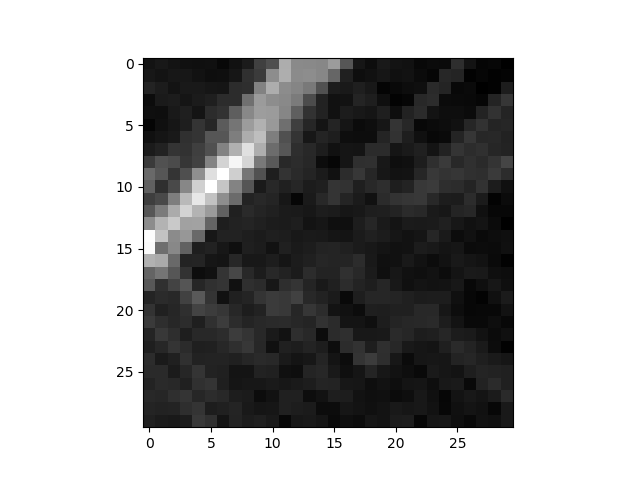
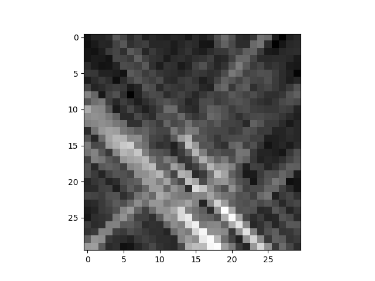
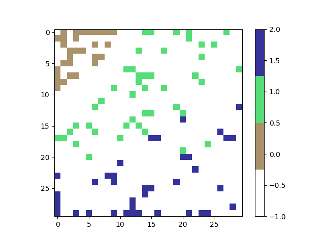
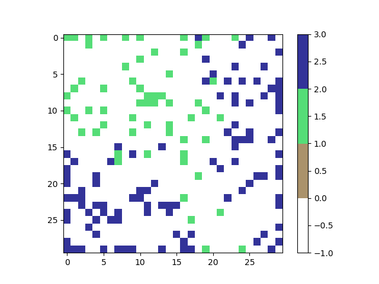

# Machine Learning Algorithms

Source: [Github](https://github.com/kiiluchris/Machine-Learning-Algorithms)

## Requirements
- Python 3

## Dependency Installation

### Using pip

    pip install numpy matplotlib

### Using pipenv

    pipenv install numpy matplotlib

## Running the code

Change directory to algorithms

Run one of the algorithms using python

### K Nearest Neighbour (KNN)

`python knn.py`

Expected output using the wheat seeds dataset: 

    Query: [40, 23]
    Label: 2.0

### K Means Clustering (KMC)

`python kmc.py`

Expected output using the wheat seeds dataset:
 
    Dataset length:  210
    Num of clusters (k): 5
    Cluster sizes
        Cluster 1 length 35
        Cluster 2 length 7
        Cluster 3 length 57
        Cluster 4 length 57
        Cluster 5 length 54

### Perceptron

`python perceptron.py`

Expected Output using custom dataset: 

    Expected: 0 Actual: 0
    Expected: 0 Actual: 0
    Expected: 0 Actual: 0
    Expected: 0 Actual: 0
    Expected: 0 Actual: 0
    Expected: 1 Actual: 1
    Expected: 1 Actual: 1
    Expected: 1 Actual: 1
    Expected: 1 Actual: 1
    Expected: 1 Actual: 1

### Adaline

`python adaline.py`

Expected Output: 

    Expected: 0 Output: 0
    Expected: 0 Output: 0
    Expected: 0 Output: 0
    Expected: 0 Output: 0
    Expected: 0 Output: 0
    Expected: 1 Output: 1
    Expected: 1 Output: 1
    Expected: 1 Output: 1
    Expected: 1 Output: 1
    Expected: 1 Output: 1

### Backpropagation

`python backpropagation.py`

Expected Output:

    Expected: 0.0 Output: 0.0
    Expected: 0.0 Output: 0.0
    Expected: 0.0 Output: 0.0
    Expected: 0.0 Output: 0.0
    Expected: 0.0 Output: 0.0
    Expected: 1.0 Output: 1.0
    Expected: 1.0 Output: 1.0
    Expected: 1.0 Output: 1.0
    Expected: 1.0 Output: 1.0
    Expected: 1.0 Output: 1.0

### Q Reinforcement

`python qreinforcement.py`

Expected Output:

    Original Q matrix
    [[0. 0. 0. 0. 0. 0.]
     [0. 0. 0. 0. 0. 0.]
     [0. 0. 0. 0. 0. 0.]
     [0. 0. 0. 0. 0. 0.]
     [0. 0. 0. 0. 0. 0.]
     [0. 0. 0. 0. 0. 0.]]
    Trained Q matrix
    [[  0.    0.    0.    0.   20.    0. ]
     [  0.    0.    0.    0.    0.  100. ]
     [  0.    0.    0.    4.    0.    0. ]
     [  0.   20.    0.8   0.   20.    0. ]
     [  0.    0.    0.    0.    0.  100. ]
     [  0.    0.    0.    0.    0.  100. ]]
    Starting point:  0
    Goal:  5
    Selected path:  [0, 4, 5]
    Starting point:  1
    Goal:  5
    Selected path:  [1, 5]
    Starting point:  2
    Goal:  5
    Selected path:  [2, 3, 1, 5]
    Starting point:  3
    Goal:  5
    Selected path:  [3, 4, 5]
    Starting point:  4
    Goal:  5
    Selected path:  [4, 5]
    Starting point:  5
    Goal:  5
    Selected path:  [5]

### Bayes

`python bayes.py`

Expected Output: 

    Probabilities {
        "Decision": {
            "No": 0.35714285714285715,
            "Yes": 0.6428571428571429
        },
        "Yes": {
            "Outlook": {
                "Overcast": 0.4444444444444444,
                "Rain": 0.3333333333333333,
                "Sunny": 0.2222222222222222
            },
            "Temp": {
                "Hot": 0.2222222222222222,
                "Mild": 0.4444444444444444,
                "Cool": 0.3333333333333333
            },
            "Humidity": {
                "High": 0.3333333333333333,
                "Normal": 0.6666666666666666
            },
            "Wind": {
                "Weak": 0.6666666666666666,
                "Strong": 0.3333333333333333
            }
            },
        "No": {
            "Outlook": {
                "Sunny": 0.6,
                "Rain": 0.4
            },
            "Temp": {
                "Hot": 0.4,
                "Cool": 0.2,
                "Mild": 0.4
            },
            "Humidity": {
                "High": 0.8,
                "Normal": 0.2
            },
            "Wind": {
                "Weak": 0.4,
                "Strong": 0.6
            }
        }
    }
    Choices {
        "Outlook": "Sunny",
        "Temp": "Cool",
        "Humidity": "High",
        "Wind": "Strong"
    }
    MAP Probabilities {'No': 0.02057142857142857, 'Yes': 0.005291005291005291}
    ML Probabilities {'No': 0.0576, 'Yes': 0.008230452674897118}
    MAP Decision: No
    ML Decision: No

### Decision Trees

`python decision_tree.py`

Expected Output: 

    { "Decision": {
        "Outlook": {
            "Overcast": "Yes",
            "Rain": {
                "Wind": {
                "Strong": "No",
                "Weak": "Yes"
                }
            },
            "Sunny": {
                "Humidity": {
                    "Normal": "Yes",
                    "High": "No"
                }
            }
        }
    }}

### Self Organizing Maps

`python som.py`

Expected Output: 

CLI 

    0 epochs done
    100 epochs done
    200 epochs done
    300 epochs done
    400 epochs done
    500 epochs done
    600 epochs done
    700 epochs done
    800 epochs done
    900 epochs done

Graph showing organized data  (Iris Dataset)

Graph showing organized data (Wheat Seeds Dataset)

Graphs showing clusters (Iris Dataset)

Graphs showing clusters (Wheat Seeds Dataset)

### Genetic Algorithms

This is an implementation of the Travelling Salesman Problem.

It uses the Roulette Selection model.

Fitness of a route is calculated using total Euclidian distance in a route normalized by dividing one by the distance.
    
is calculated using Euclidian distance between randomized cities turned into a ratio by dividing 1 by the dist

`python genetic.py`

Expected Output: 

Total Distance in route over time

